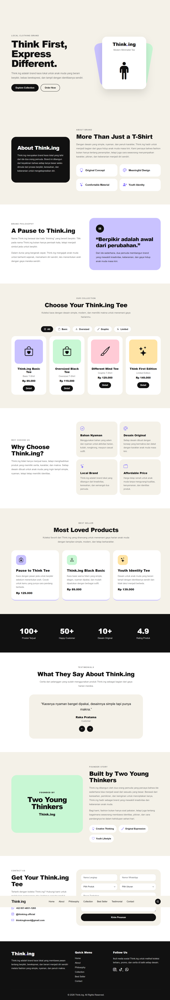
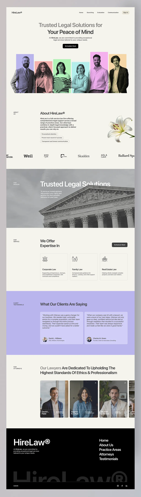

## Judul Project

Website Company Profile Brand Kaos Think.ing dengan Konsep Modern Minimalist dan Fitur Interaktif

## Hasil Project

## Refrensi Project

## Modifikasi Desain
- Referensi HireLaw dimodifikasi dari website layanan hukum menjadi website company profile brand kaos Think.ing.
- Identitas, konten, dan isi section disesuaikan dengan filosofi brand Think.ing.
- Section layanan diubah menjadi product collection brand kaos.
- Section tim/attorneys diubah menjadi founder story.
- Contact section diubah menjadi form order produk.
- Desain tetap mempertahankan konsep modern minimalist dengan warna cream, hitam, putih, dan aksen pastel.
- Website ditambahkan fitur interaktif seperti dark mode, filter produk, testimonial slider, counter animation, dan validasi form.

## Final Testing

Project website company profile Think.ing telah selesai dibuat dan telah dilakukan pengecekan pada beberapa bagian utama.

### Pengecekan yang Dilakukan

- Navbar berjalan dan dapat berpindah ke setiap section.
- Website memiliki lebih dari 8 section.
- Tampilan website sudah responsive pada laptop, tablet, dan mobile.
- Fitur dark mode dan light mode berjalan.
- Fitur filter product collection berjalan.
- Counter animation berjalan.
- Testimonial slider berjalan.
- Form order menampilkan validasi ketika input kosong.
- Footer tampil dengan baik.
- README sudah berisi screenshot hasil website dan referensi desain.

### Kesimpulan

Website Company Profile Brand Kaos Think.ing dengan Konsep Modern Minimalist dan Fitur Interaktif sudah memenuhi ketentuan UTS Pemrograman Web karena dibuat menggunakan HTML, CSS, Bootstrap, JavaScript, jQuery, memiliki fitur manipulasi DOM, dan memiliki lebih dari 8 section.